# weweb-dynamic-metadata
⭐ Build-time SEO metadata generator for WeWeb static exports

[](https://www.npmjs.com/package/weweb-dynamic-metadata)
[](https://www.npmjs.com/package/weweb-dynamic-metadata)
[](https://opensource.org/licenses/MIT)
[](https://github.com/Mel000000/weweb-dynamic-metadata)

A build-time tool that generates unique SEO metadata for each dynamic page in your WeWeb project. Zero runtime overhead, perfect SEO, and completely free.

---

## Table of Contents

- [Overview](#overview)
- [Why This Package Matters](#why-this-package-matters)
- [Who This Is For](#who-this-is-for)
- [Why This Project Exists](#why-this-project-exists)
- [Usage Example](#usage-example)
- [Architecture](#architecture)
- [Features](#features)
- [Quick Start](#quick-start)
- [Prerequisites Checklist](#prerequisites-checklist)
- [Setup](#setup)
  - [1. Configure Supabase](#1-configure-supabase)
  - [2. Create Config File](#2-create-config-file)
  - [3. Run the Generator](#3-run-the-generator)
- [How It Works](#how-it-works)
  - [1. Reads Your Config](#1-reads-your-config)
  - [2. Discovers Content IDs](#2-discovers-content-ids)
  - [3. Fetches Metadata](#3-fetches-metadata)
  - [4. Generates Central Metadata](#4-generates-central-metadata)
  - [5. Injects Script into Template](#5-injects-script-into-template)
  - [6. Creates Reference Files](#6-creates-reference-files)
- [Project Folder Transformation](#project-folder-transformation)
- [Output Summary](#output-summary)
- [Programmatic Usage](#programmatic-usage)
- [Why Not Cloudflare Workers?](#why-not-cloudflare-workers)
- [Troubleshooting](#troubleshooting)
- [License](#license)
---

## Overview

WeWeb exports static HTML files where all dynamic routes (like `/article/1`, `/article/2`) share the **exact same HTML template** with identical metadata. This is terrible for SEO - every article page looks identical to search engines.

This package solves that by generating a **central metadata file** and **tiny reference HTML files** that point to your main template. The result? Each article page gets its own unique metadata while maintaining a single source of truth.

### Repository Structure
- **📦 This Package**: The npm package that does the metadata generation
- **📦 Your WeWeb Project**: Where you install and run it

### Key challenges addressed:
- Complete generation in ~1 second for 100 articles  
- Zero runtime overhead - all metadata pre-generated
- Tiny footprint - only ~500 bytes per article

---

## Why This Package Matters

WeWeb currently has **no built-in solution** for dynamic SEO metadata. Every dynamic page shares the same HTML template, making SEO optimization impossible.

This package provides a **production-tested solution** that:
- Gives each page unique metadata
- Requires no serverless functions
- Works with any hosting platform
- Preserves all WeWeb dynamic functionality

---

## Who This Is For

This package is ideal for:

- WeWeb users needing SEO for dynamic pages
- Developers deploying WeWeb to any static host
- Projects requiring unique metadata per page
- Teams wanting zero-latency SEO solution

This package may NOT be ideal if:

- Your content changes every minute (use server-side instead)
- You can't run build scripts in your deployment
- You need real-time metadata updates

---

## Why This Project Exists

WeWeb's dynamic pages share HTML templates, making unique metadata impossible. Official solutions require Cloudflare Workers (cost, complexity, latency).

This project provides a **simpler, cheaper, faster alternative**:

- **Zero runtime costs** - Everything runs at build time
- **Perfect SEO** - Instant HTML for crawlers
- **Dead simple** - Just a config file and one command
- **Works everywhere** - Any static hosting works

---

## Usage Example

1. Export your WeWeb project (creates `dist/` folder)
2. Create `weweb.config.js` in your project root
3. Run `npx weweb-dynamic-metadata`
4. Deploy anywhere - each article now has unique metadata!

```bash
# One-time setup
npm install --save-dev weweb-dynamic-metadata

# Generate metadata (run after each WeWeb export)
npx weweb-dynamic-metadata

# That's it! Your articles now have unique SEO metadata
```

## Features

- 🚀 **Zero Runtime Overhead**: All metadata pre-generated at build time
- 📦 **Tiny Footprint**: Only ~500 bytes per article (reference files)
- 🎯 **Perfect SEO**: Each page gets unique titles, descriptions, and Open Graph tags
- 🔧 **Simple Setup**: Just add a config file and run
- 💸 **Completely Free**: No Cloudflare Workers, no serverless costs
- 🌍 **Works Everywhere**: Deploy to any static hosting (Netlify, Vercel, GitHub Pages, S3, etc.)
- ⚡ **Fast**: Generates 1000 articles in ~3 seconds
- 🔗 **Commit Traceability**: Optional git-info.js injection for deploy visibility

## Quick Start
```bash
# 1. Install the package
npm install --save-dev weweb-dynamic-metadata

# 2. Create weweb.config.js in your project root
# (see Setup section below)

# 3. Run it!
npx weweb-dynamic-metadata

# Done! Your articles now have unique metadata
```
## Getting Started

###  Prerequisites Checklist
Before using this package, ensure you have:
- A WeWeb project exported to static files (has ``article/_param/index.html``)
- Node.js 18 or higher installed
- A Supabase project with your content
- Your Supabase URL and anon key ready
- Your WeWeb build folder (usually ``dist/`` or project root)

### Setup
#### 1. Configure Supabase
Create a view in your Supabase database for optimal performance:
```sql
-- Create a view for article metadata
CREATE VIEW article_metadata AS
SELECT 
  id,
  title,
  LEFT(content, 160) AS excerpt,  -- First 160 chars for descriptions
  image_url
FROM articles;

-- Enable public read access
ALTER VIEW article_metadata ENABLE ROW LEVEL SECURITY;

CREATE POLICY "Allow public read access" 
ON article_metadata
FOR SELECT 
TO anon 
USING (true);
```
#### 2. Create Config File
Create ``weweb.config.js`` in your project root:
```javascript
export default {
  // Your Supabase configuration
  supabase: {
    url: process.env.SUPABASE_URL,
    anonKey: process.env.SUPABASE_ANON_KEY
  },
  
  // Optional: Specify your build folder (defaults to ./dist)
  outputDir: "./dist",
  
  // Define your dynamic routes
  pages: [
    {
      route: "/article/:id",
      table: "articles",              // Your Supabase table name
      metadata: {
        title: "title",                // Database field for title 
        content: "excerpt",            // Database field for description
        image: "featured_image"        // Database field for image
      }
    }
  ]
};
```
#### 3. Run the Generator
```bash
# One-time generation
npx weweb-dynamic-metadata

# Add to your package.json scripts
{
  "scripts": {
    "build:metadata": "weweb-dynamic-metadata",
    "build": "weweb export && weweb-dynamic-metadata"
  }
}
```

## How It Works

### 1. Reads Your Config
The package reads ``weweb.config.js`` from your project root to understand your Supabase connection and dynamic routes.

### 2. Discovers Content IDs
Fetches all IDs from your Supabase table to know which articles need metadata.

### 3. Fetches Metadata
For each ID, retrieves the metadata fields you specified (title, content, image, etc.).

### 4. Generates Central Metadata
Creates a central JavaScript file with all metadata:
```javascript
window.METADATA = {
  "1": { title: "Article 1", content: "...", image: "..." },
  "2": { title: "Article 2", content: "...", image: "..." },
  // ... one entry per article
};
```

### 5. Injects Script into Template
Adds the metadata injector script to your ``your-page-name/_param/index.html`` template.

### 6. Creates Reference Files
Generates tiny HTML files for each article that load the template and pass the article ID:
```html
<!-- article/1/index.html - only ~500 bytes! -->
<script>
  window.CURRENT_ARTICLE_ID = "1";
  window.location.replace('../_param/index.html#1');
</script>
```

## Architecture

```mermaid
flowchart TD
    %% Styles
    classDef setup fill:#2da44e,stroke:#1a7f37,color:#ffffff
    classDef core fill:#0969da,stroke:#0550ae,color:#ffffff
    classDef output fill:#8250df,stroke:#6639ba,color:#ffffff
    classDef runtime fill:#f66a0a,stroke:#bf4e00,color:#ffffff
    classDef note fill:#fff,stroke:#6e7781,color:#24292f,stroke-width:1px,stroke-dasharray:3 3

    subgraph Setup ["🟢 User Setup (One Time)"]
        A["User exports WeWeb project<br/>creates static files"] --> B
        B["User creates weweb.config.js<br/>in project root"] --> C
        C["Configure:<br/>• Supabase URL & anonKey<br/>• Dynamic routes (/article/:id)<br/>• Table & metadata fields<br/>• Optional: outputDir"] --> D
        D["Save config file"]
    end
    class A,B,C,D setup

    subgraph Build ["🔵 Build Time - Metadata Generation"]
        direction TB
        E["Run: npx weweb-dynamic-metadata"] --> F
        F["Read weweb.config.js"] --> G
        G["Validate configuration"] --> I["For each dynamic route:<br/>e.g., /article/:id"]
        
        I --> J["Discover content IDs<br/>GET /rest/v1/table?select=id"]
        J --> K["IDs: [1, 2, 3, ...]"]
        
        K --> L["Fetch metadata for each ID<br/>GET /rest/v1/table?id=eq.{id}"]
        L --> M["Build central metadata object<br/>{1: {...}, 2: {...}, ...}"]
        
        M --> N["Generate article/metadata.js<br/>window.METADATA = {...}"]
        
        N --> O["Locate WeWeb template<br/>article/_param/index.html"]
        O --> P["Inject metadata script into template"]
        
        P --> Q["For each ID, create reference file:<br/>article/1/index.html<br/>article/2/index.html<br/>..."]
        
        Q --> R["Copy metadata.js to _param/<br/>for backward compatibility"]
    end
    class E,F,G,I,J,K,L,M,N,O,P,Q,R core

    subgraph Output ["🟣 Generated Output"]
        S["📁 article/<br/>├── metadata.js<br/>├── _param/<br/>│   ├── index.html (modified)<br/>│   └── metadata.js<br/>├── 1/<br/>│   ├── index.html (reference)<br/>│   └── metadata.js<br/>├── 2/<br/>│   ├── index.html (reference)<br/>│   └── metadata.js<br/>└── ..."]
    end
    class S output

    subgraph Runtime ["🟠 Runtime - Browser"]
        T["User visits /article/2"] --> U
        U["Browser loads article/2/index.html<br/>(tiny reference file)"] --> V
        V["JavaScript sets window.CURRENT_ARTICLE_ID=2<br/>and loads _param/index.html"] --> W
        W["Main template loads with ID=2"] --> X
        X["Metadata injector reads window.METADATA[2]<br/>and updates page metadata"] --> Y
        Y["Page displays with correct title,<br/>description, Open Graph tags"]
    end
    class T,U,V,W,X,Y runtime

    %% Connections
    D ==> E
    R ==> S
    S ==> T

    %% Legend
    L1["🟢 User Setup: One-time configuration"]:::note
    L2["🔵 Build Time: Generates metadata + reference files"]:::note
    L3["🟣 Output: Generated files ready for deployment"]:::note
    L4["🟠 Runtime: Browser loads and applies metadata"]:::note
    L5["⚙️ weweb.config.js: Central configuration file"]:::note
    
    L1 ~~~ L2 ~~~ L3 ~~~ L4 ~~~ L5
```


## Project Folder Transformation

### Before: WeWeb Export (No Metadata)
```text
dist/ (or your build folder)
├── your-page-name/
│   └── _param/
│       └── index.html              # Same for ALL articles!
├── assets/
├── index.html
└── ...            # Sitemap
```

**The Problem**: Every article at `/your-page-name/1`, `/your-page-name/2`, etc. serves the EXACT same HTML file with identical metadata.

---
### After: Package Runs
```
dist/
├── your-page-name/
│   ├── metadata.js                    # Central metadata for all articles
│   ├── _param/
│   │   ├── index.html                  # Original template (script injected)
│   │   └── metadata.js                  # Copy for compatibility
│   ├── 1/
│   │   ├── index.html                   # Tiny reference file (~500 bytes)
│   │   └── metadata.js                   # Points to central metadata
│   ├── 2/
│   │   ├── index.html                   # Tiny reference file
│   │   └── metadata.js                   # Points to central metadata
│   └── ...
├── assets/
└── index.html

```
**The Solution**: Each article now has its own unique metadata while sharing the same template!

## Output Summary

After running, you'll get a JSON summary:
```json
{
  "timestamp": "2024-03-14T20:49:28.825Z",
  "pages": [
    {
      "route": "/article/:id",
      "total": 150,
      "succeeded": 150,
      "failed": 0,
      "metadataEntries": 150,
      "referencesCreated": 150
    }
  ],
  "totalMetadataEntries": 150,
  "outputDirectories": ["dist/article"],
  "duration": "2.34"
}
```
## Programmatic Usage

```javascript
import { processFiles } from 'weweb-dynamic-metadata';

const result = await processFiles();
console.log(`Generated ${result.totalMetadataEntries} metadata entries`);
console.log(`Took ${result.duration} seconds`);
```
## Why Not Cloudflare Workers?

| Approach | This Package | Cloudflare Worker |
|----------|--------------|-------------------|
| **Runtime** | None (pre-generated) | Each request |
| **Latency** | 0ms | +100-300ms |
| **Cost** | Free | Pay per request |
| **SEO** | Perfect - instant HTML | Crawlers might timeout |
| **Complexity** | Simple config | Worker deployment |
| **Scaling** | Infinite (static files) | Worker limits |
| **Cold starts** | None | Possible |

## Troubleshooting

| Issue | Likely Cause | Solution |
|-------|--------------|----------|
| `getOutputDir: Could not find build folder` | No WeWeb export found | Run `weweb export` first or set `outputDir` in config |
| `Config error: Invalid or unexpected token` | BOM characters in config | Recreate file without BOM (use VSCode "Save with Encoding → UTF-8") |
| No metadata generated | Supabase connection issue | Check your Supabase URL and anon key |
| `Failed to fetch ID` | Table or field names wrong | Verify table and field names in config |
| Reference files not created | Permission issues | Check write permissions in build folder |

## License

This project is licensed under the MIT License. See the LICENSE file for details.
