# weweb-metadata

The Core Concept: A build-time tool that generates unique HTML files for each piece of dynamic content (blog posts, products, etc.) with SEO metadata pre-injected, while keeping all of WeWeb's dynamic functionality intact.

## Key Principles:

- No workers - users don't deploy or maintain anything
- No unnecessary rebuilds - only generate what's needed, when needed
- Smart split - important content (blog, products) gets full HTML files at build time; user-generated content (profiles) gets simpler handling since metadata matters less
- Works everywhere - outputs static files that deploy to any hosting platform
- Builds on existing CI/CD - integrates with GitHub Actions

**The Problem It Solves**: WeWeb's dynamic pages all share the same HTML template, which means they share the same metadata. Your tool gives each page its own metadata for SEO, without breaking any of WeWeb's dynamic functionality.

**The Trade-off Acknowledged**: Content created after deployment (new user profiles) won't have HTML files immediately. But metadata for those pages is less critical, so either default metadata or simple periodic rebuilds are "good enough."

## Architecture
### Flowchart

```mermaid
flowchart TD
    %% Styles
    classDef setup fill:#2da44e,stroke:#1a7f37,color:#ffffff
    classDef core fill:#0969da,stroke:#0550ae,color:#ffffff
    classDef deploy fill:#8250df,stroke:#6639ba,color:#ffffff
    classDef note fill:#fff,stroke:#6e7781,color:#24292f,stroke-width:1px,stroke-dasharray: 3 3

    subgraph Setup [User Setup - One Time]
        A["User builds WeWeb project<br/>with dynamic pages"] --> B
        B["User creates weweb.config.js file"] --> C
        C["User fills out config:<br/>• Dynamic routes (/article/:id)<br/>• Metadata API endpoint<br/>• ID source (API/sitemap/list)<br/>• Optional: fallback metadata"] --> D
        D["User saves config in project root"]
    end
    class A,B,C,D setup

    subgraph Build [Build Time - Core Engine]
        E["Build process starts"] --> F
        F["Read weweb.config.js<br/>from project root"] --> G
        G["Parse configuration<br/>and validate"] --> H
        H["For each dynamic route:<br/>e.g., /article/:id"] --> I
        I["Discover all content IDs<br/>• Call ID source API<br/>• Parse sitemap<br/>• Use provided list"] --> J
        J["Example: IDs [1, 2, 3, ...]"] --> K
        
        K["For EACH discovered ID:"] --> L
        L["Fetch metadata from API<br/>GET /api/article/{id}/meta"] --> M
        M["Response format:<br/>{title, description, image, keywords}"] --> N
        N["Generate HEAD snippet:<br/>/article/heads/1.html"] --> O
        
        O["Create template file:<br/>/article/index.html<br/>with <!-- METADATA --> placeholder"] --> P
        P["Continue until all IDs processed"] --> Q
        Q["Output:<br/>• 1 template file per route<br/>• N head snippet files"]
    end
    class E,F,G,H,I,J,K,L,M,N,O,P,Q core

    subgraph Request [Request Time - Edge Injection]
        R["User requests /article/123"] --> S
        S["Server/Edge gets template:<br/>/article/index.html"] --> T
        T["Server gets head snippet:<br/>/article/heads/123.html"] --> U
        U["Inject head into template<br/>at <!-- METADATA --> placeholder"] --> V
        V["Send complete HTML to browser:<br/>• Vue app loads<br/>• Correct metadata in place"]
    end
    class R,S,T,U,V deploy

    %% Connections
    D ==> E
    Q ==> R

    %% Simple stacked legend using nodes with invisible connections
    L1["🟢 User Setup: One-time configuration"]:::note
    L2["🔵 Build Time: Generates template + head snippets"]:::note
    L3["🟣 Request Time: Injects correct head dynamically"]:::note
    L4["⚙️ weweb.config.js: Central configuration file"]:::note
    
    L1 ~~~ L2 ~~~ L3 ~~~ L4
```

### Project Folder Transformation
#### Before: WeWeb Export (No Metadata)
```
dist/ (or built project root)
├── article/
│   └── _param/                    # Dynamic route template
│       └── index.html              # The file you'll transform!
├── assets/                          # JS, CSS, images (hashed filenames)
├── data/                             # Static data files
├── fonts/Phosphor/                   # Font files
├── icons/lucide/                      # Icon files
├── images/                             # Image assets
├── index.html                          # Homepage
├── manifest.json                        # PWA manifest
├── robots.txt                            # SEO
├── serviceworker.js                       # PWA service worker
└── sitemap.xml                              # Sitemap
```

**The Problem**: Every article at `/article/1`, `/article/2`, etc. serves the EXACT same HTML file with identical metadata.

---
#### After: Tool Runs
```
dist/
├── index.html                          # Unchanged
├── about.html                           # Unchanged
├── article/
│   ├── index.html                       # TEMPLATE with <!-- METADATA --> placeholder
│   │                                     # Vue app still loads dynamically!
│   │
│   ├── heads/                            # Generated head snippets
│   │   ├── 1.html                        # <title>Article 1</title><meta...>
│   │   ├── 2.html                        # <title>Article 2</title><meta...>
│   │   ├── 3.html                        # <title>Article 3</title><meta...>
│   │   └── ...                            # One per article
│   │
│   └── (optional with edge injection)
│       ├── 1/
│       │   └── index.html                 # Complete static file (alternative)
│       ├── 2/
│       │   └── index.html
│       └── ...
│
├── product/
│   ├── index.html                       # TEMPLATE with placeholder
│   └── heads/
│       ├── 101.html
│       ├── 102.html
│       └── ...

```
## Setup

### Superbase

#### Metadata Enpoint (setting up View for direct access)

```
-- Create a view that formats your article data as metadata
CREATE VIEW properties_metadata AS
SELECT 
  id,
  title AS meta_title,
  LEFT(content, 160) AS meta_description,  -- First 160 chars for description
  image_url AS og_image,
  'article, blog, ' || LOWER(title) AS keywords  -- Simple keywords
FROM properties;
```
#### setting up Security
```
-- Enable RLS on your table
ALTER TABLE properties ENABLE ROW LEVEL SECURITY;

-- Allow public read access
CREATE POLICY "Allow public read access" 
ON properties
FOR SELECT 
TO anon 
USING (true);
```
